# AP_CF_PAPER: Project Diagrams

## 1. System Architecture Diagram

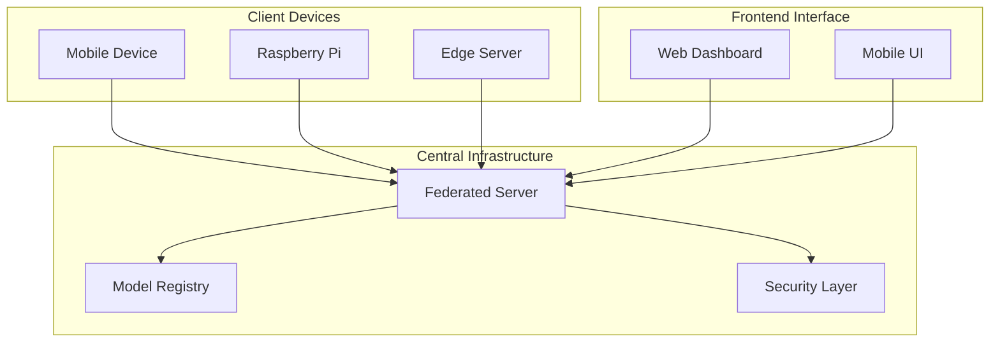

## 2. Federated Learning Workflow Diagram

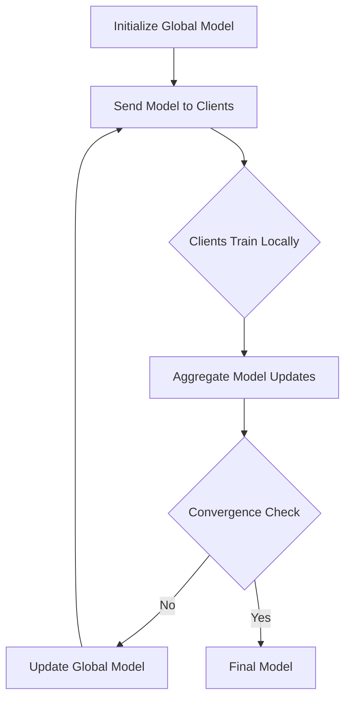

## 3. Client-Server Communication Diagram

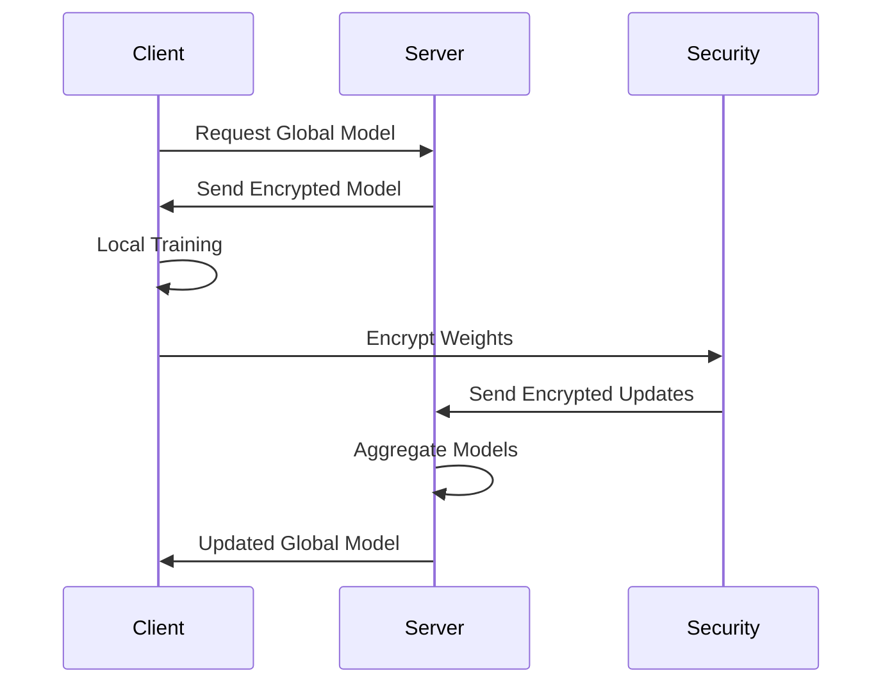

## 4. Knowledge Distillation Process Diagram

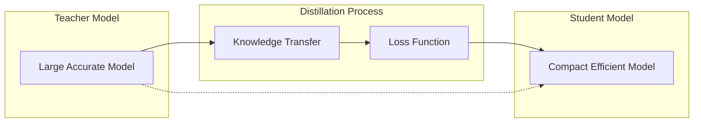

## 5. Data Processing Pipeline Diagram

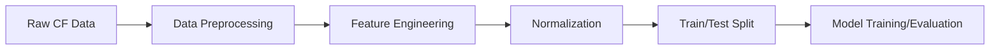

## 6. Synthetic Data Generation Flow

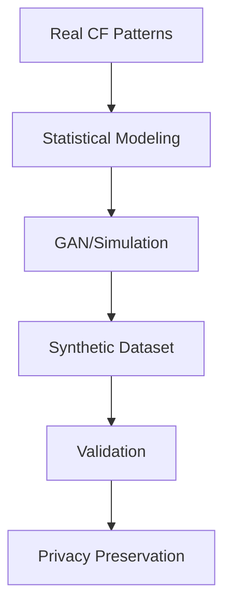

## 7. Model Training Data Flow

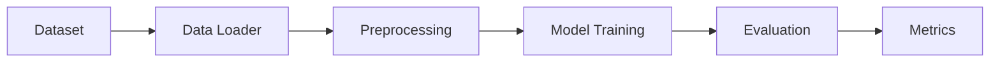

## 8. Inference Data Flow

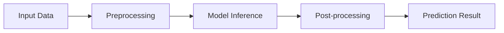

## 9. Teacher Model Architecture

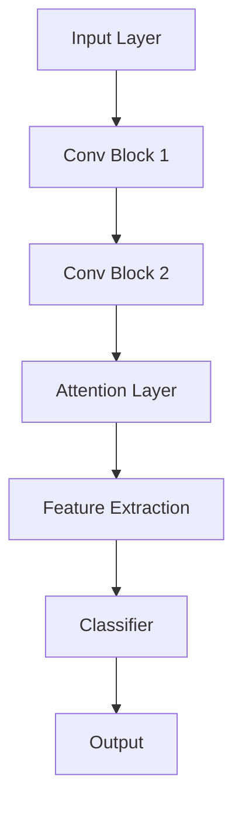

## 10. Student Model Architecture

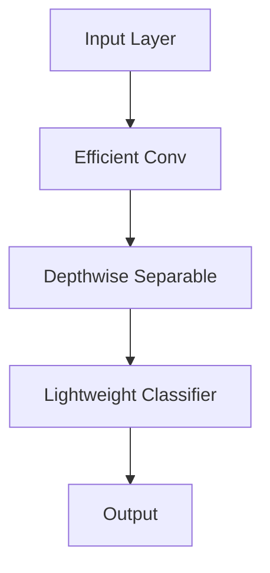

## 11. Federated Training Process

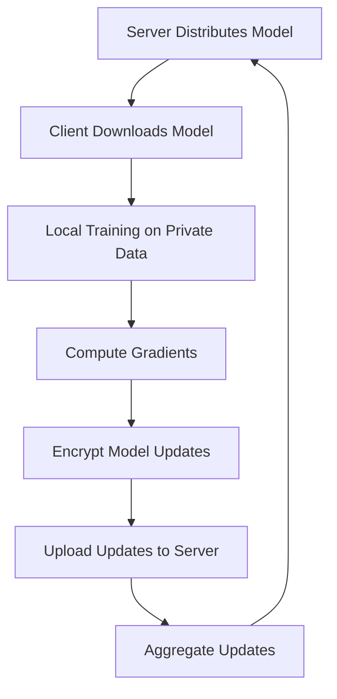

## 12. Model Evaluation Workflow

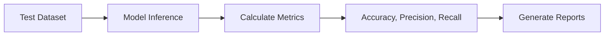

## 13. Deployment Pipeline

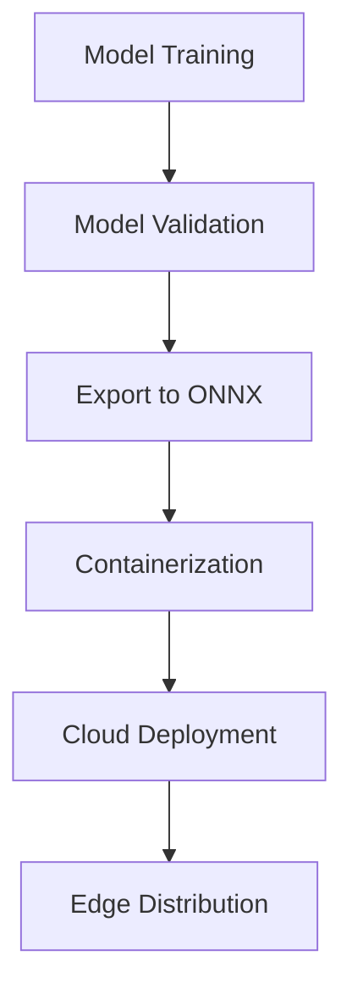

## 14. Privacy-Preserving Mechanism Flow

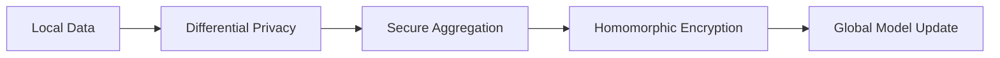

## 15. Model Accuracy Comparison

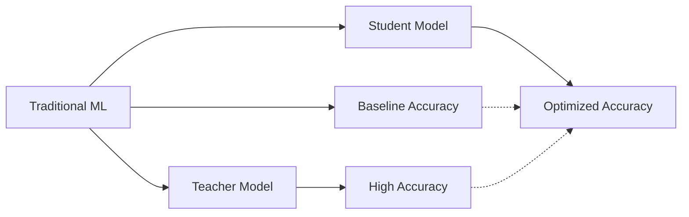

## 16. Resource Utilization Chart

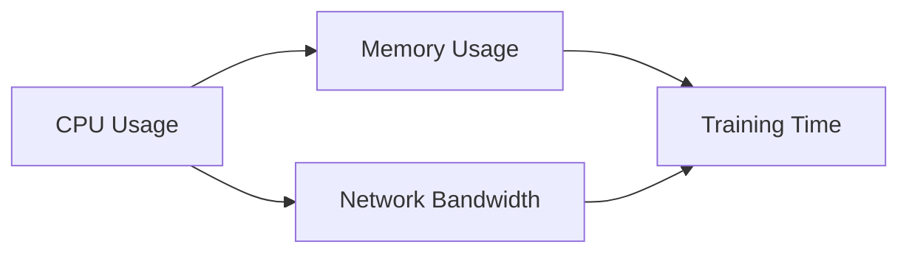

## 17. Latency Performance Graph

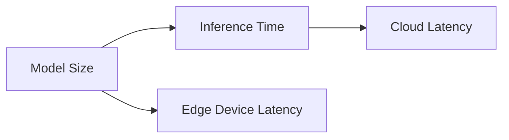