# AP_CF_PAPER: Project Diagrams

## 1. System Architecture Diagram

This diagram illustrates the complete system architecture showing how different components interact in the federated learning environment for cystic fibrosis prediction.

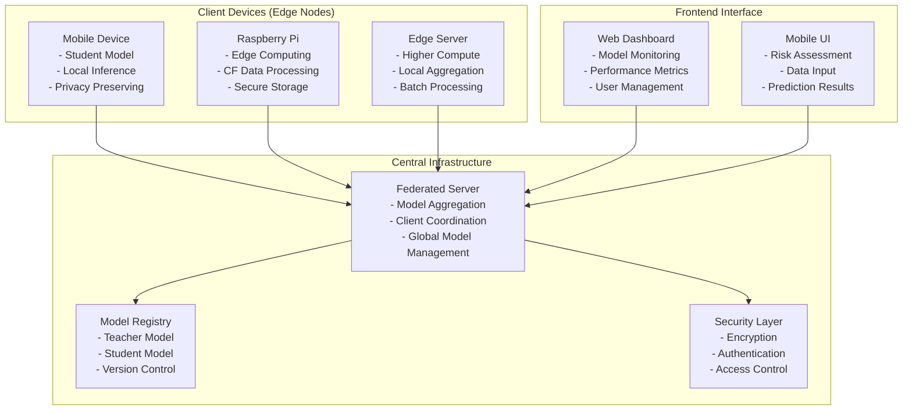

## 2. Federated Learning Workflow Diagram

This diagram shows the complete federated learning process from initialization to convergence, highlighting the iterative nature of distributed model training.

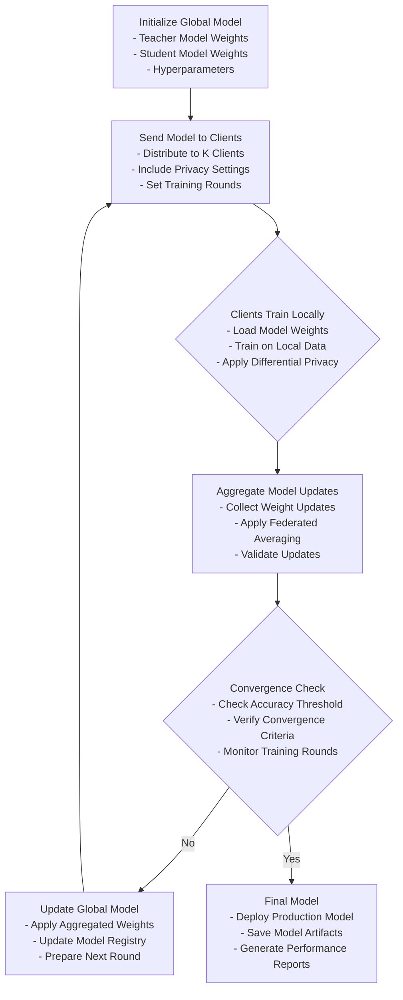

## 3. Client-Server Communication Diagram

This sequence diagram details the secure communication protocol between client devices and the federated server, emphasizing privacy preservation.

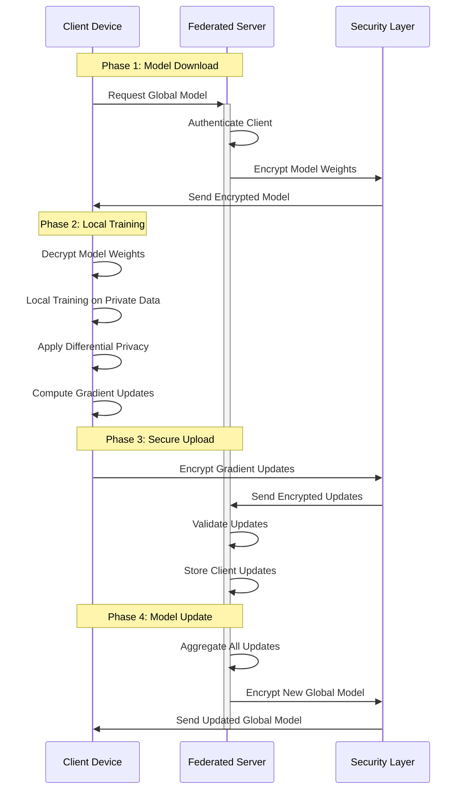

## 4. Knowledge Distillation Process Diagram

This diagram illustrates the knowledge transfer mechanism from the large teacher model to the compact student model, which is crucial for edge deployment.

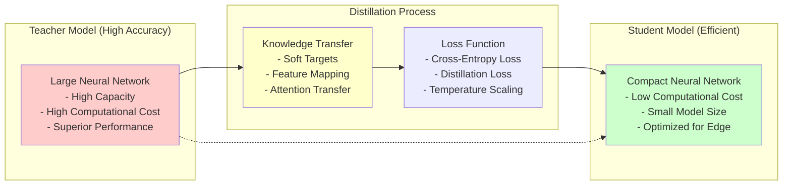

## 5. Data Processing Pipeline Diagram

This diagram outlines the complete data processing pipeline from raw CF data to ready-to-use training data, ensuring privacy and quality.

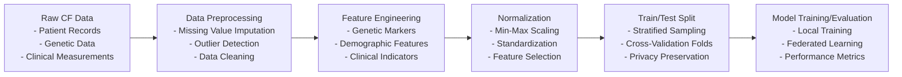

## 6. Synthetic Data Generation Flow

This diagram shows the process of creating synthetic CF datasets that preserve privacy while maintaining statistical properties of real data.

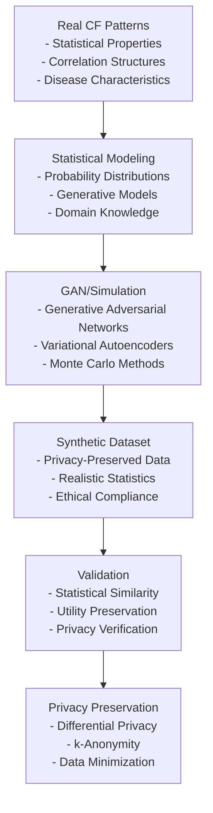

## 7. Model Training Data Flow

This diagram details the data flow during model training, from dataset loading to final metrics computation.

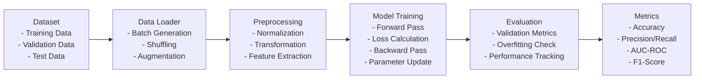

## 8. Inference Data Flow

This diagram shows the complete inference process from input data to final prediction, optimized for edge devices.

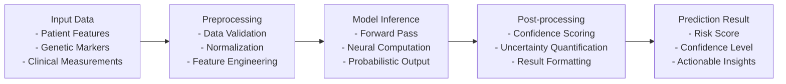

## 9. Teacher Model Architecture

This diagram illustrates the detailed architecture of the teacher model, highlighting its capacity for high accuracy in CF prediction.

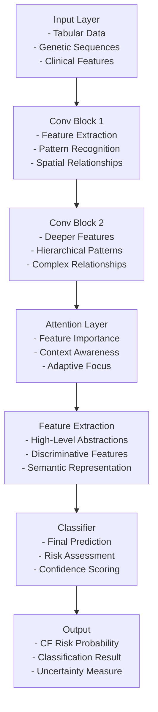

## 10. Student Model Architecture

This diagram shows the streamlined architecture of the student model, optimized for efficient edge deployment while maintaining predictive capability.

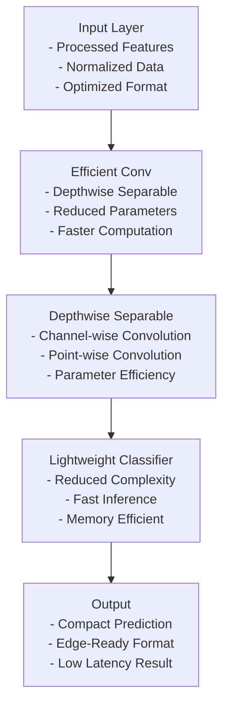

## 11. Federated Training Process

This diagram details the complete federated training cycle, showing how local training contributes to global model improvement.

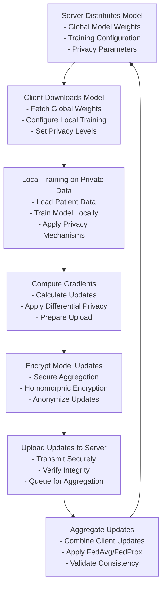

## 12. Model Evaluation Workflow

This diagram outlines the comprehensive evaluation process for assessing model performance in the CF prediction task.

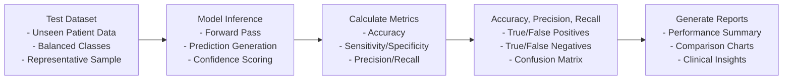

## 13. Deployment Pipeline

This diagram shows the complete deployment pipeline from model training to edge device distribution.

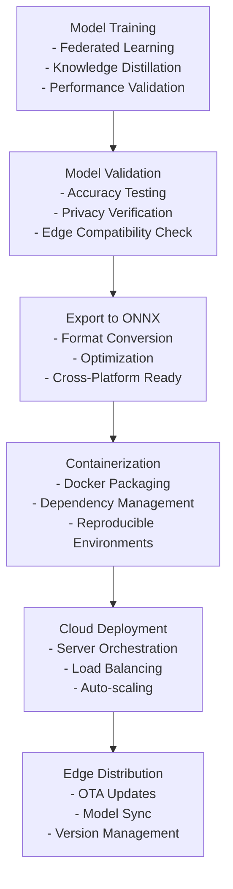

## 14. Privacy-Preserving Mechanism Flow

This diagram illustrates the layered privacy preservation approach used throughout the system.

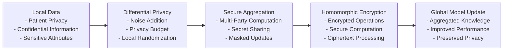

## 15. Model Accuracy Comparison

This diagram compares the performance characteristics of different model approaches in the system.

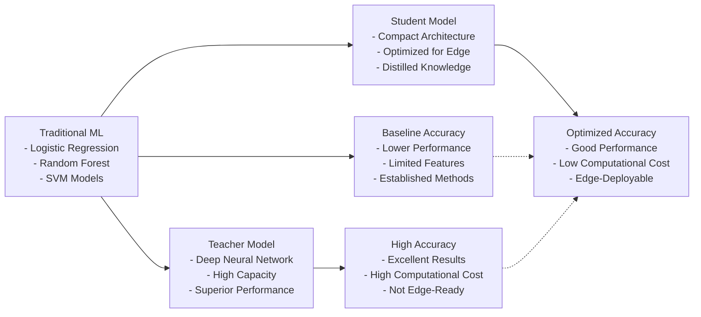

## 16. Resource Utilization Chart

This diagram shows the interdependencies between different resource utilization metrics in the system.

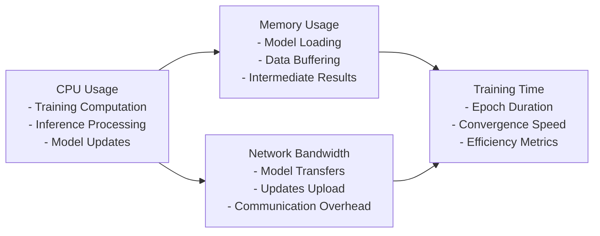

## 17. Latency Performance Graph

This diagram illustrates the relationship between model size and inference latency across different deployment scenarios.

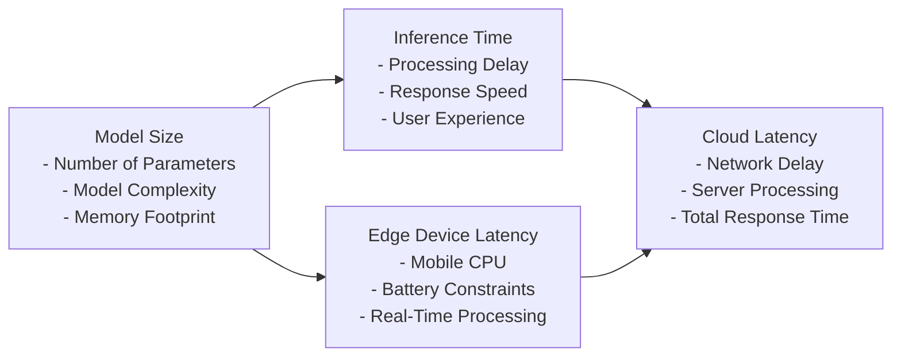
