# AP_CF_PAPER: Project Diagrams

## 1. System Architecture Diagram

This diagram illustrates the complete system architecture showing how different components interact in the federated learning environment for cystic fibrosis prediction.

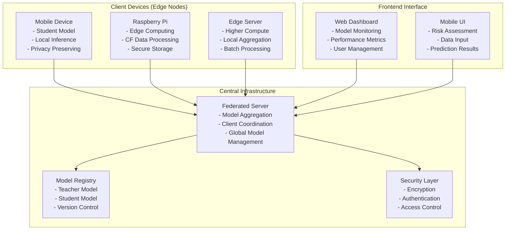

## 2. Federated Learning Workflow Diagram

This diagram shows the complete federated learning process from initialization to convergence, highlighting the iterative nature of distributed model training.

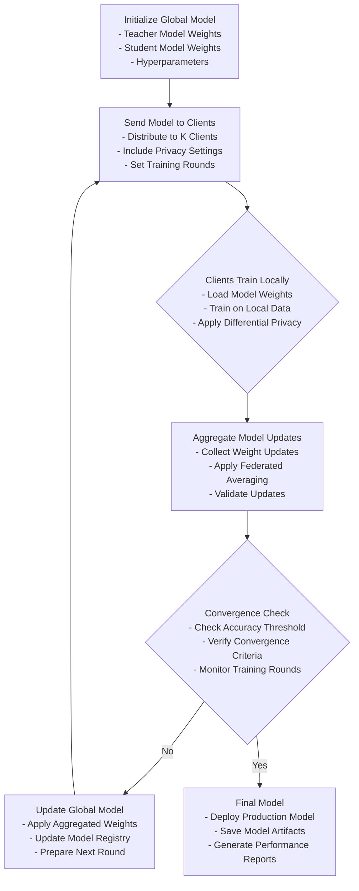

## 3. Client-Server Communication Diagram

This sequence diagram details the secure communication protocol between client devices and the federated server, emphasizing privacy preservation.

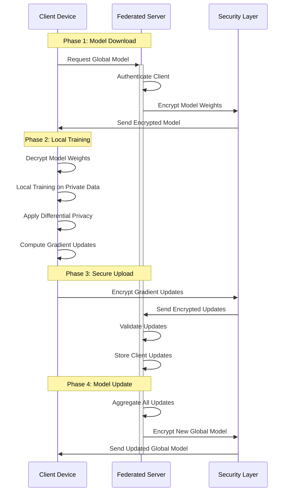

## 4. Knowledge Distillation Process Diagram

This diagram illustrates the knowledge transfer mechanism from the large teacher model to the compact student model, which is crucial for edge deployment.

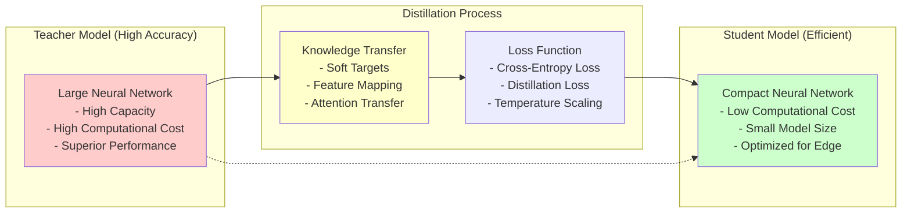

## 5. Data Processing Pipeline Diagram

This diagram outlines the complete data processing pipeline from raw CF data to ready-to-use training data, ensuring privacy and quality.

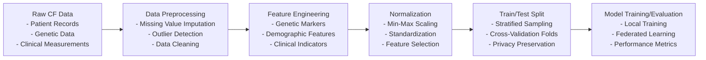

## 6. Synthetic Data Generation Flow

This diagram shows the process of creating synthetic CF datasets that preserve privacy while maintaining statistical properties of real data.

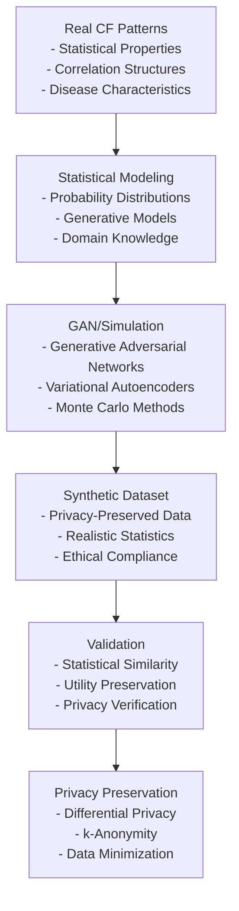

## 7. Model Training Data Flow

This diagram details the data flow during model training, from dataset loading to final metrics computation.

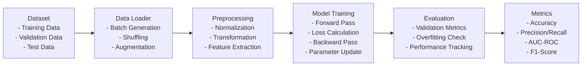

## 8. Inference Data Flow

This diagram shows the complete inference process from input data to final prediction, optimized for edge devices.

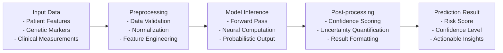

## 9. Teacher Model Architecture

This diagram illustrates the detailed architecture of the teacher model, highlighting its capacity for high accuracy in CF prediction.

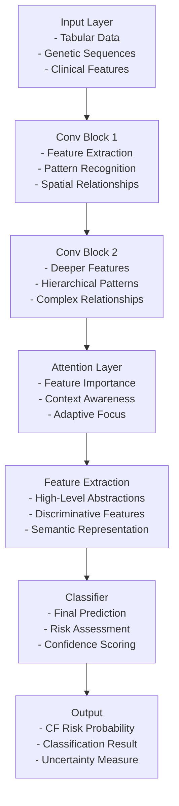

## 10. Student Model Architecture

This diagram shows the streamlined architecture of the student model, optimized for efficient edge deployment while maintaining predictive capability.

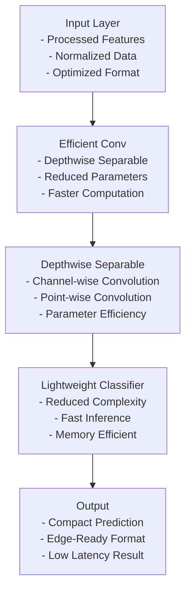

## 11. Federated Training Process

This diagram details the complete federated training cycle, showing how local training contributes to global model improvement.

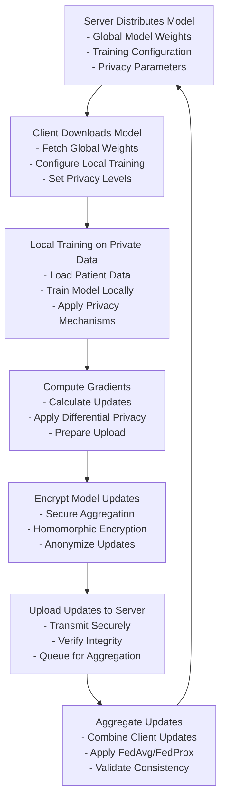

## 12. Model Evaluation Workflow

This diagram outlines the comprehensive evaluation process for assessing model performance in the CF prediction task.

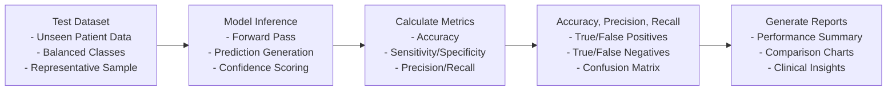

## 13. Deployment Pipeline

This diagram shows the complete deployment pipeline from model training to edge device distribution.

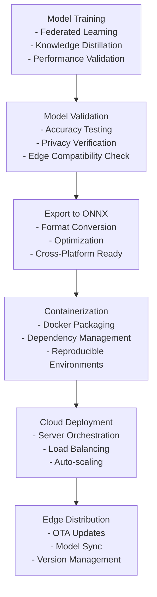

## 14. Privacy-Preserving Mechanism Flow

This diagram illustrates the layered privacy preservation approach used throughout the system.

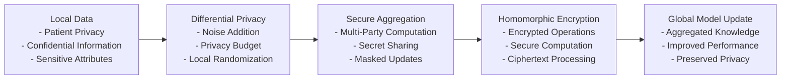

## 15. Model Accuracy Comparison

This diagram compares the performance characteristics of different model approaches in the system.

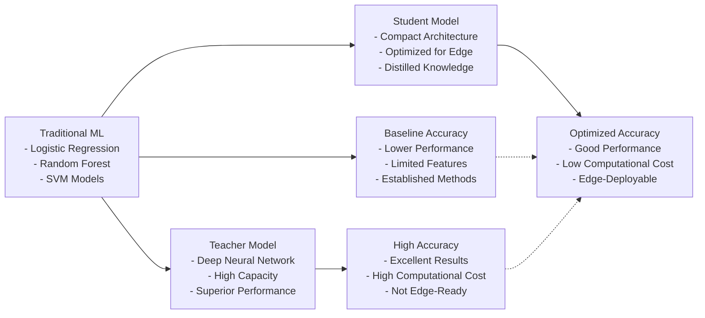

## 16. Resource Utilization Chart

This diagram shows the interdependencies between different resource utilization metrics in the system.

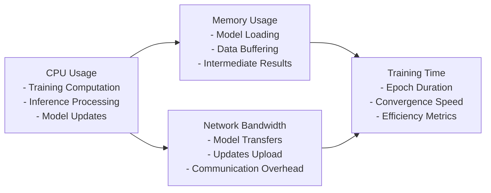

## 17. Latency Performance Graph

This diagram illustrates the relationship between model size and inference latency across different deployment scenarios.

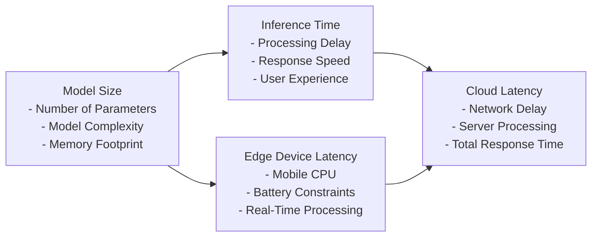

## 18. High-Level System Design Diagram

This diagram provides an overview of the complete system architecture with all major components and their interactions.

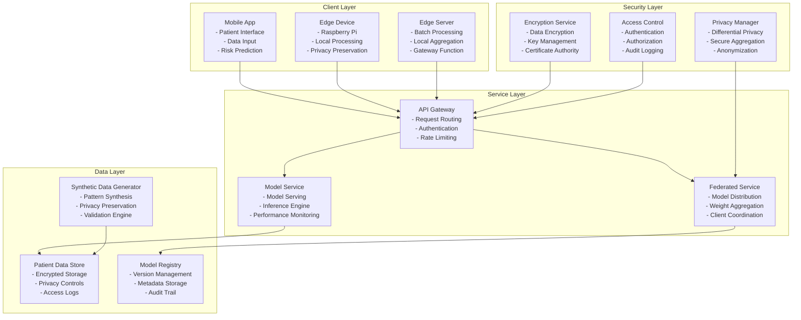

## 19. UML Class Diagram

This UML class diagram shows the main classes and their relationships in the system.

```mermaid
classDiagram
    class CFModel {
        <<abstract>>
        - model_id: str
        - version: str
        - hyperparameters: dict
        + train(data: np.ndarray, epochs: int): None
        + evaluate(test_data: np.ndarray): dict
        + predict(input_data: np.ndarray): np.ndarray
        + save(path: str): None
        + load(path: str): None
    }
    
    class TeacherModel {
        - num_layers: int
        - hidden_size: int
        - attention_heads: int
        + forward(x: torch.Tensor): torch.Tensor
        + compute_loss(predictions: torch.Tensor, targets: torch.Tensor): torch.Tensor
        + extract_features(x: torch.Tensor): torch.Tensor
    }
    
    class StudentModel {
        - compressed_size: int
        - quantized: bool
        - distillation_temperature: float
        + forward(x: torch.Tensor): torch.Tensor
        + distill(teacher_output: torch.Tensor): torch.Tensor
        + compress_weights(): None
        + quantize_model(): None
    }
    
    class FederatedClient {
        - client_id: str
        - is_active: bool
        - local_model: CFModel
        - data_manager: CFDataManager
        - privacy_manager: PrivacyManager
        + local_train(data: np.ndarray): dict
        + update_weights(global_weights: dict): None
        + send_updates(server: FederatedServer): dict
        + receive_global_model(model_state: dict): None
        + validate_local_model(test_data: np.ndarray): dict
    }
    
    class FederatedServer {
        - clients: list[FederatedClient]
        - global_model: CFModel
        - round_number: int
        - aggregation_strategy: str
        - privacy_budget: float
        + aggregate_weights(client_updates: list[dict]): dict
        + distribute_model(clients: list[FederatedClient]): None
        + coordinate_training(num_rounds: int): None
        + select_clients(num_clients: int): list[FederatedClient]
        + broadcast_global_model(): None
    }
    
    class CFDataManager {
        - dataset_path: str
        - preprocessing_config: dict
        - feature_columns: list[str]
        - target_column: str
        + load_data(): pd.DataFrame
        + preprocess(raw_data: pd.DataFrame): np.ndarray
        + split_data(train_ratio: float): tuple
        + validate_data(data: np.ndarray): bool
        + generate_synthetic_data(num_samples: int): pd.DataFrame
    }
    
    class PrivacyManager {
        - epsilon: float
        - delta: float
        - noise_multiplier: float
        - clip_bound: float
        + apply_differential_privacy(gradient: torch.Tensor): torch.Tensor
        + secure_aggregate(weights_list: list[dict]): dict
        + encrypt_data(data: bytes): bytes
        + decrypt_data(encrypted_data: bytes): bytes
        + calculate_privacy_budget(noise_level: float, steps: int): float
    }
    
    class ModelEvaluator {
        - metrics_config: dict
        - confidence_threshold: float
        + calculate_accuracy(y_true: np.ndarray, y_pred: np.ndarray): float
        + calculate_precision_recall(y_true: np.ndarray, y_pred: np.ndarray): tuple
        + calculate_auc_roc(y_true: np.ndarray, y_scores: np.ndarray): float
        + generate_report(results: dict): str
        + plot_confusion_matrix(y_true: np.ndarray, y_pred: np.ndarray): plt.Figure
        + plot_roc_curve(y_true: np.ndarray, y_scores: np.ndarray): plt.Figure
    }
    
    class ModelRegistry {
        - registry_path: str
        - models: dict[str, dict]
        + register_model(model: CFModel, metadata: dict): str
        + get_model(model_id: str, version: str): CFModel
        + list_models(): list[dict]
        + delete_model(model_id: str, version: str): bool
        + update_model_metadata(model_id: str, version: str, metadata: dict): bool
    }
    
    class APIServer {
        - host: str
        - port: int
        - model_service: ModelRegistry
        - federated_service: FederatedServer
        + start_server(): None
        + stop_server(): None
        + predict_endpoint(request: dict): dict
        + train_endpoint(request: dict): dict
        + register_client_endpoint(client_info: dict): str
    }
    
    CFModel <|-- TeacherModel
    CFModel <|-- StudentModel
    TeacherModel <..> StudentModel : Knowledge Distillation
    FederatedClient o-- CFModel : uses
    FederatedClient --> CFDataManager : uses
    FederatedClient --> PrivacyManager : uses
    FederatedServer o-- CFModel : manages
    FederatedServer --> ModelEvaluator : uses
    FederatedServer }--{ FederatedClient : coordinates
    CFDataManager --> ModelEvaluator : provides_data
    PrivacyManager <-- FederatedClient : applies_privacy
    PrivacyManager <-- FederatedServer : aggregates_securely
    ModelRegistry <-- APIServer : serves_models
    APIServer --> FederatedServer : manages_federation
```

## 20. UML Sequence Diagram

This UML sequence diagram shows the interaction between components during a federated learning round.

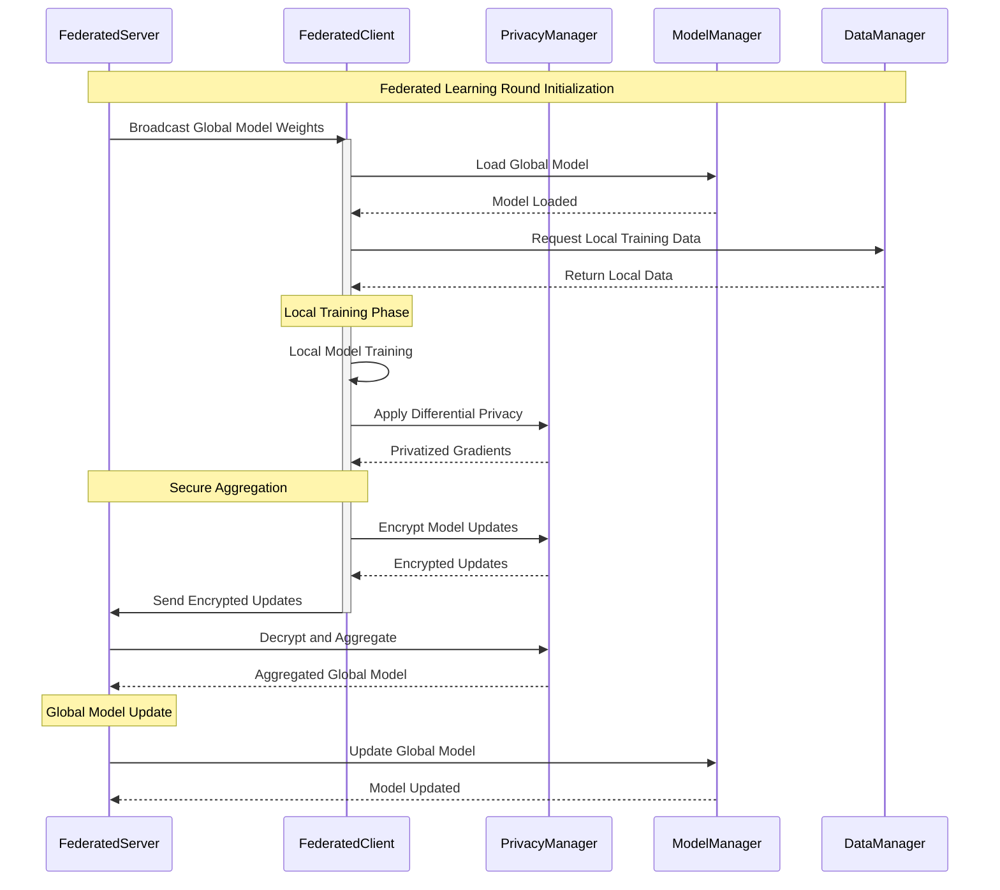

## 21. Entity Relationship Diagram

This ER diagram shows the relationships between different entities in the system.

```mermaid
erDiagram
    PATIENT {
        string patient_id PK
        string genetic_markers
        json clinical_data
        datetime created_at
        datetime updated_at
    }
    
    MODEL_VERSION {
        string model_id PK
        string version PK
        string model_type
        float accuracy
        datetime created_at
        json architecture
    }
    
    TRAINING_SESSION {
        string session_id PK
        string model_id FK
        string client_id
        int round_number
        float local_loss
        datetime start_time
        datetime end_time
    }
    
    CLIENT {
        string client_id PK
        string device_type
        string location
        boolean is_active
        datetime registered_at
    }
    
    MODEL_UPDATE {
        string update_id PK
        string session_id FK
        string model_id FK
        json weights
        float differential_privacy_epsilon
        datetime timestamp
    }
    
    EVALUATION_RESULT {
        string result_id PK
        string model_id FK
        string dataset_id
        float accuracy
        float precision
        float recall
        float auc_score
        json confusion_matrix
        datetime evaluated_at
    }
    
    PATIENT ||--o{ TRAINING_SESSION : participates_in
    MODEL_VERSION ||--o{ TRAINING_SESSION : used_for
    CLIENT ||--o{ TRAINING_SESSION : executes
    TRAINING_SESSION ||--o{ MODEL_UPDATE : generates
    MODEL_VERSION ||--o{ EVALUATION_RESULT : evaluated
```